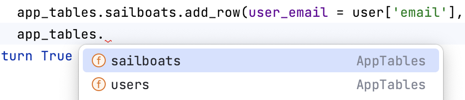
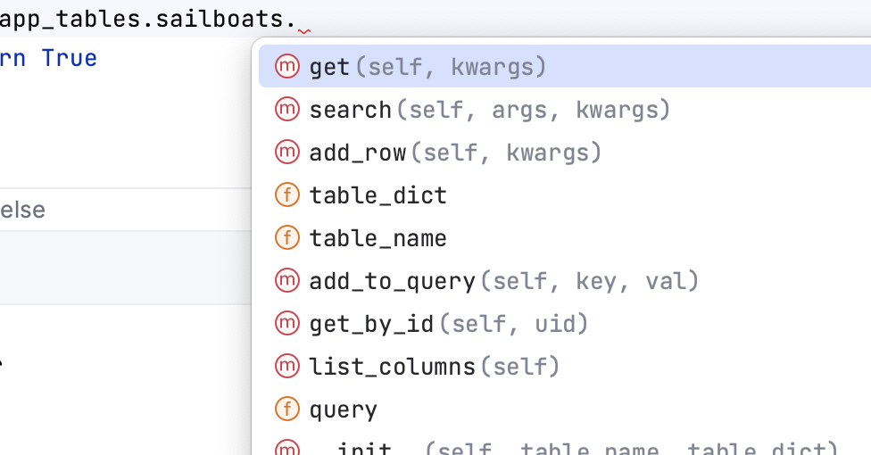
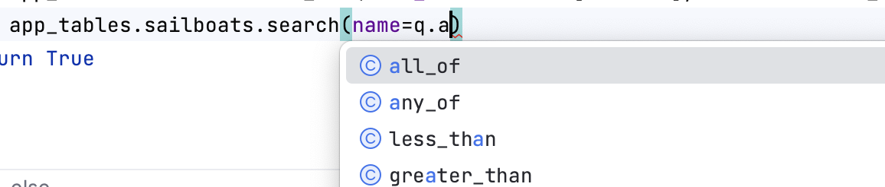
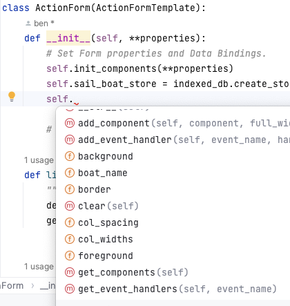

Example App using anvil_works_design_test
==========================================
A self-contained example of the [anvil_works_design_test](https://github.com/benlawraus/anvil_works_design_test) module to write, edit, test and debug an
[anvil.works](https://anvil.works) application. If you have an 
account, clone it here:

[cached_lists_anvil_works](https://anvil.works/build#clone:HCI3ZLAYFMXTTBEV=UY765JHOSBBLTQZADVICCZDJ|C6ZZPAPN4YYF5NVJ=)

This repo only illustrates the code-completion and test functions of [anvil_works_design_test](https://github.com/benlawraus/anvil_works_design_test). It does not illustrate normal use. Use [anvil_works_design_test](https://github.com/benlawraus/anvil_works_design_test) scripts instead.

The example website is a simple database of sail boats.  It allows you to Create, Update and Delete sailboats both in
the database and in the browser's indexedDB storage.

This repo was created using [anvil_works_design_test](https://github.com/benlawraus/anvil_works_design_test). 

Install
=======

    git clone https://github.com/benlawraus/cached_lists_anvil_works

The below commands are in [init_project.zsh](init_project.zsh), so after downloading
the repo, you can run that script to install the dependencies and run the tests.

    chmod +x init_project.zsh
    ./init_project.zsh

OR run the commands below manually:

    cd cached_lists_anvil_works
    git remote remove origin
    # virtual environment
    python3 -m venv ./venv;
    source venv/bin/activate
    # install dependencies
    pip3 install strictyaml
    pip3 install pyDAL
    pip3 install pytest
    pip3 install pytest-tornasync

    python3 -m pytest tests_project

Illustrates:-
=============

Coding
-------
If you open the files in the client_code and server_code directories in the PyCharm IDE,
    you will have
  * auto-correct
  * auto-complete (with database table names etc)
  * type checking (e.g. using typing module for server and client code [PEP 484](https://peps.python.org/pep-0484/#suggested-syntax-for-python-2-7-and-straddling-code))
    for
    1. your functions and classes
    2. the functions and classes on [anvil.works](https://anvil.works)
    3. **As a bonus, GitHub's co-pilot is also available to help you write your code.**

### Examples

#### Auto-complete on database tables

#### Auto-complete on database functions

#### Auto-complete on anvil.works functions

#### Auto-complete on forms in client_code

Testing
-------
The repo contains tests using pytest. Here (heavily commented):
[tests_project](tests_project)

- These tests were written as the code was written i.e. Test Driven Development (TDD).

- Instantiate a (client_code) form class and use its methods to click buttons. Use its attributes to input
into forms.  
- Call server functions from the client code.

- Debugging. PyCharm lets you place break-points anywhere for debugging.

- Database
    + SQLite is used to save and retrieve database entries using the same anvil.works commands,
    just like the online database. PyCharm lets you view and edit the database, just as in the browser editor. The SQLite database is in tests/database.

### Example
See the pytest file [test_020_CRUD.py](tests_project/test_020_CRUD.py)

